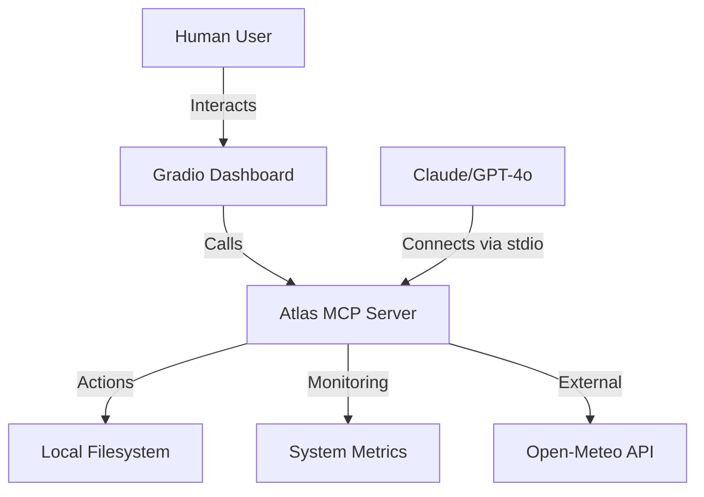

# 🚀 Atlas: Agentic MCP Workspace Assistant

Atlas is a professional-grade Model Context Protocol (MCP) ecosystem designed for workspace management and system orchestration. It features a reactive **Gradio Dashboard** and a high-performance **MCP Server** that bridges the gap between human users and AI agents.

---

## 🌟 Key Features

### 🖥️ 1. Atlas Dashboard (`app.py`)
A modern, reactive multi-tab interface:
- **🤖 Smart Assistant**: Chat with an LLM that is directly connected to Atlas's local tools.
- **📁 Workspace Explorer**: Live view of your project files with real-time status.
- **📈 System Monitor**: Real-time gauges for CPU and Memory usage using `psutil`.
- **📝 Persistent Notes**: A structured system to save and retrieve markdown notes.

### 🏛️ 2. Atlas MCP Server (`atlas_server.py`)
A comprehensive server that exposes your workspace to local agents (like Claude Desktop):
- **🛠️ Tools**: 
    - `get_weather`: Professional real-time weather integration.
    - `add_note` / `list_notes`: File-system backed persistent storage.
    - `list_files` / `read_workspace_file`: Secure-path-constrained file operations.
- **📚 Resources**: 
    - `system://metrics`: JSON-ready system stats.
    - `notes://{title}`: Dynamic URI scheme for note retrieval.

---

## 🏗️ Architecture



---

## 🚀 Getting Started

### 1. Prerequisites
- Python 3.10+
- Dependencies: `pip install mcp psutil gradio httpx`

### 2. Run the Dashboard
```bash
python app.py
```
This will launch a local server (usually at `http://localhost:7860`).

### 3. Connect as an MCP Server
To use these tools inside **Claude Desktop**, add this to your config:

```json
{
  "mcpServers": {
    "atlas-assistant": {
      "command": "python",
      "args": ["/absolute/path/to/atlas_server.py"]
    }
  }
}
```

---

## 🏛️ Project Structure
- `app.py`: The reactive frontend.
- `atlas_server.py`: Core MCP logic & tools.
- `.notes/`: Directory for persistent workspace data.
- `simple_mcp/`: Original fundamentals lab.

---

## ⚖️ License
MIT License. Created by [good2idnan](https://github.com/good2idnan).
