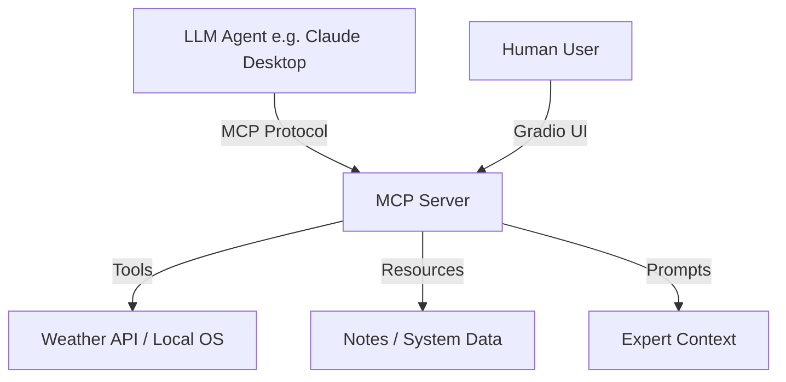

# 🚀 MCP Fundamentals and Apps

A professional exploration of the **Model Context Protocol (MCP)**, demonstrating how to bridge the gap between large language models and local/external tools. This repository serves as a portfolio piece showing both core MCP primitives and practical, UI-driven implementations.

---

## 🌟 Key Features

### 🖥️ 1. Weather Dashboard (`gradio_weather.py`)
A real-time weather application powered by **Gradio** and **Open-Meteo**.
- **Agentic Integration**: Launches as an MCP server with a built-in tool that an LLM can use to fetch weather for any city globally.
- **Interactive UI**: A full web interface to visualize results while the agent works behind the scenes.

### 🏛️ 2. MCP Core Primitives (`server.py`)
A pure FastMCP implementation that demonstrates the three fundamental pillars of the protocol:
- **🛠️ Tools**: Callable functions like `get_weather` for direct agent interaction.
- **📚 Resources**: Exposing weather data via a URI scheme (`weather://{location}`) for context retrieval.
- **💡 Prompts**: Templated instructions (`weather_prompt`) to guide the LLM's personality and output style.

### 🧮 3. Simple Math Lab (`simple_mcp/`)
A "Hello World" style implementation for learning MCP basics:
- Basic math tools (`add`, `multiply`).
- Dynamic echoing resources.
- Clear, beginner-friendly codebase.

---

## 🏗️ Architecture



---

## 🚀 Getting Started

### 1. Prerequisites
- Python 3.10+
- [uv](https://github.com/astral-sh/uv) (Recommended) or `pip`

### 2. Installation
```bash
# Clone the repository
git clone https://github.com/good2idnan/mcp-fundamentals-and-apps.git
cd mcp-fundamentals-and-apps

# Install dependencies
pip install -r requirements.txt
# OR if using uv
uv sync
```

### 3. Running the Apps
- **Launch the Weather Dashboard**:
  ```bash
  python gradio_weather.py
  ```
- **Test with MCP Inspector**:
  ```bash
  mcp dev server.py
  ```

---

## 🔌 Connecting to Claude Desktop
Add the following to your `claude_desktop_config.json`:

```json
{
  "mcpServers": {
    "weather-agent": {
      "command": "python",
      "args": ["/absolute/path/to/server.py"]
    }
  }
}
```

---

## 🛣️ Roadmap
- [ ] **Atlas Cockpit**: A unified dashboard for system management.
- [ ] **Secure File Explorer**: Advanced MCP tools for local file searching.
- [ ] **Database Integration**: Persisting agent memory via local SQLite.

---

## ⚖️ License
MIT License. Feel free to use and adapt these patterns for your own MCP projects!
